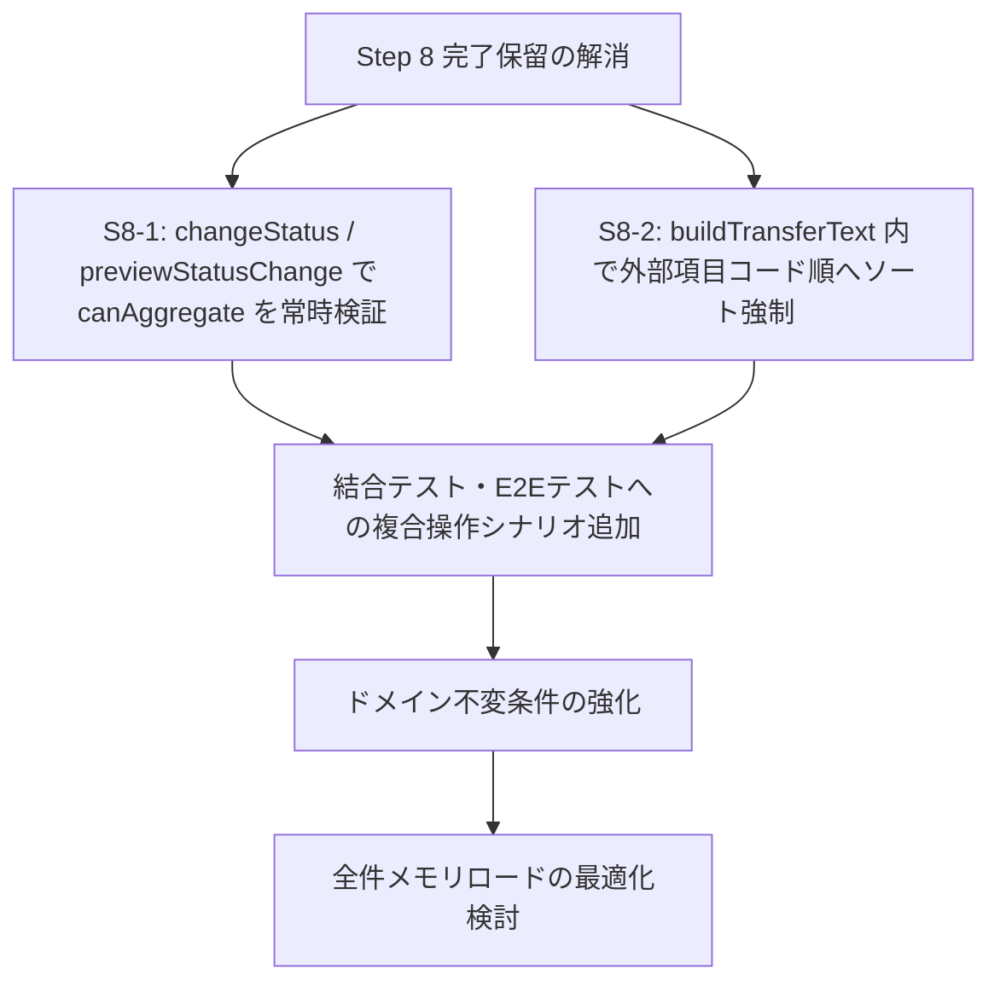

# 全体構造および現時点の敵対的検証レポート（Adversarial Review Report）

| 項目     | 内容                                                              |
| -------- | ----------------------------------------------------------------- |
| 文書番号 | PWT-REVIEW-005                                                    |
| 版数     | 1.0                                                               |
| 作成日   | 2026-08-06                                                        |
| 対象     | プロジェクト全体（仕様・設計・実装・状態遷移・パフォーマンス・UX） |
| 参照文書 | 仕様書 1.2、PWT-PLAN-001、PWT-REVIEW-004（Step 8 レビュー）      |
| 取扱     | 公開可能。組織固有情報および実運用データを含めないこと            |

---

## 1. 総合評価

> [!WARNING]
> **総合判定: リリース保留推奨 (Step 8 レビュー未クリア)**
> Vitest（1,172件）および Playwright E2E（116件）の自動テストはすべて成功していますが、**単一アクションのテストでは捕捉できない「特定の操作順序（状態変更後の再編集等）」により、仕様上あり得ない矛盾データがDBへ永続化される欠陥**が残存しています。

> [!NOTE]
> **2026-08-06 追記: 2.1（S8-1）・2.2（S8-2）・3.1 は対応済み。** §6 に各指摘への回答を記録した。3.1 は暫定策で終わらせず、**確認付きの再開**として恒久対応し、仕様書1.3 へ反映した（§6.4）。Vitest 1,197件・E2E 119件が成功している。§3・§4 の残りのうち、3.3 と 4.3 は事実誤認または仕様どおりと判断した（根拠は §6.2）。3.2・4.1・4.2 は既存の記録（FB-9、C-10、13章の性能目標）へ紐づけた。

本プロジェクトは、純粋関数ベースのドメインモデル設計、`StorageAdapter` によるストレージ層の分離、外部依存のない構成（Vanilla JS / Vitest / Playwright）など、非常に高い開発品質で構築されています。

しかし、批判的・敵対的（Adversarial）な視点で検証を行った結果、本番運用や特定のエッジケースにおいて破綻しうる重大な懸念点・バグ・設計の矛盾が確認されました。

---

## 2. 【重大 (Major)】仕様・状態遷移の抜け穴とデータ破損リスク

### 2.1 「集計済み」状態で新規未終了区間を追加し、「転記済み」へ遷移できてしまう (指摘 S8-1)
- **関連箇所**: `src/domain/runStatus.js`, `src/app/actions/transferActions.js`
- **問題概要**:
  - 実施回が集計済み（`AGGREGATED`）になっても `isRunEditable()` は `true` を返すため、新しい作業区間を開始（`endTime = null`）できます。
  - その後「転記済みにする (`markTransferred`)」を実行すると、`changeStatus` 内の `canAggregate` チェックが `from === WORKING && nextStatus === AGGREGATED` の組み合わせでしか発動しないため、**未終了区間が存在する（転記値が未確定な）まま「転記済み」へ保存できてしまいます**。
- **影響・リスク**:
  - 外部システムへ転記できない未確定データが `status = "transferred"` としてDBにロックされます。
  - 「転記済み」になると `isRunEditable` が `false`（閲覧専用）になるため、利用者は**理由を入力して「集計済み」へ戻さない限り、その未終了区間を終了することも修正・削除することもできなくなります**。
- **根本原因**:
  「自動遷移を行わない」原則と「集計済み状態での編集許可」を併用しているにもかかわらず、`AGGREGATED -> TRANSFERRED` 遷移時にデータの中身の不変条件（`canAggregate`）を再検証していないためです。

### 2.2 画面のソート順切り替えがクリップボードコピーテキストの順序を破壊する (指摘 S8-2)
- **関連箇所**: `src/domain/aggregate.js`, `src/ui/views/summaryView.js`
- **問題概要**:
  - 仕様書 8.7.7 では「クリップボードへコピーするテキストは**外部項目コード順**」と定められています。
  - しかし、`summaryView.js` は画面上で選択されている並び順（表示順 / 定義順）で生成した集計結果 `aggregate` をそのまま `buildTransferText()` に渡しています。
- **影響・リスク**:
  - 画面の表示順を変更した後にコピーを行うと、**コピーテキストも表示順に変わってしまいます**。外部システムへの転記作業において、行の並び順前提で転記を行う利用者が入力ミスを起こす重大な原因となります。

---

## 3. 【中位 (Moderate)】仕様設計・計算ロジック・ドメインモデルのエッジケース

### 3.1 「自動遷移なし」原則と「集計済み」の定義の形骸化
- **問題点**:
  仕様書 7.1 では「条件が揃っても自動で集計済みには遷移しない」としています。一方、集計済み状態の実施回に新たな作業区間や直接入力を追加した際も、自動で「作業中」へは戻りません。
- **検討結果**:
  集計済み状態で編集を行っても状態が「集計済み」のまま維持されるため、「集計済み ＝ 未終了区間がなく転記値が確定している状態」という**ドメイン上の定義（Invariants: 不変条件）が一時的に破綻**します。編集が行われた時点で強制的に「作業中」へ差し戻すか、遷移時の全ガードを厳格化しない限り、ドメインモデルの整合性を保てません。

### 3.2 深夜跨ぎ・タイムゾーン変更・夏時間（DST）での日付境界（`workDate`）の不整合
- **問題点**:
  - 作業区間は ISO8601 文字列（`startTime`/`endTime`）で記録され、実施回は `workDate`（`YYYY-MM-DD`）を持ちます。
  - 日付を跨ぐ作業（例: 23:00 ～ 翌02:00）の場合、`workDate` は開始日のままになりますが、クライアント端末のタイムゾーンが変更されたり夏時間切替タイミングを跨ぐと、ローカル時刻計算（`datetime.js`）で時間の逆転や計算ずれが発生するリスクがあります。

### 3.3 「参加者変更」操作時の精度損失と工数切り上げの累積影響
- **問題点**:
  - 進行中の作業区間を指定時刻で分割する「参加者変更（仕様書 8.4.5）」において、旧区間の終了時刻と新規区間の開始時刻が同一秒で記録されます。
  - 作業項目ごとの工数計算（`aggregate.js`）では、最終的に分単位へ切り上げ（`Math.ceil(seconds / 60)`）を行います。
  - 細切れな区間分割（参加者の頻繁な出入り）が行われた場合、切り上げのタイミング（項目合計後に1回だけ切り上げる仕様）により、実際の作業時間と参加人数の積に対して予期せぬ切上げ誤差が膨らむ可能性があります。

---

## 4. 【中位/軽微 (Moderate/Minor)】アーキテクチャ・ストレージ・パフォーマンスの死角

### 4.1 メモリ全件ロード (`loadAll()`) による将来的なスケーラビリティの破綻
- **問題点**:
  仕様書 5.3 にある通り、`IndexedDbAdapter.loadAll()` は IndexedDB 内の**すべての実施回・全作業区間・全履歴データを起動時および変更時にメモリ上へ一括読み込み**しています。
- **検討結果**:
  1人運用であっても、数ヶ月〜数年運用して作業区間データが数万件規模に達した場合、アプリ起動時や集計の再計算時にメインスレッドが数秒間フリーズします。Web Worker も採用されていないため、UIのレンダリングが完全にブロックされます。

### 4.2 JSONエクスポート / インポート時の非対称性と整合性チェックの限界
- **問題点**:
  `importAll()` において `validateImportPayload` によるスキーマチェックは行われていますが、**存在しない `taskDefinitionId` や存在しない `runId` を参照する孤立した作業区間（Orphan Intervals）**がインポートされた場合、ドメイン層の集計処理で例外が発生するか、無効な行として静かに無視される可能性があります。

### 4.3 マルチタブ起動時の排他制御の欠落
- **問題点**:
  仕様書 8.10 では多重タブ警告について触れていますが、同一ブラウザで2つのタブを開き、**タブAで「転記済み」に変更し、タブBで「作業区間を追加」した場合、IndexedDBの別トランザクションとして両方が成功してしまう**可能性があります。

---

## 5. 敵対的検証に基づく改善ロードマップ

1. **【最優先】S8-1 の解消**:
   `transferActions.js` の `changeStatus()` および `previewStatusChange()` において、`nextStatus === TRANSFERRED` への遷移時にも必ず `canAggregate(current)` を評価し、未終了区間が存在する場合は遷移を拒否する。
2. **【最優先】S8-2 の解消**:
   `aggregate.js` の `buildTransferText()` 内で、渡された `aggregate.rows` のソート順に依存せず、常に「外部項目コードの自然順」に並べ直してからコピー文字列を構築する。
3. **【推奨】複合シーケンスのテスト追加**:
   「集計済み → 作業区間追加 → 転記済み操作」や「画面ソート切り替え → クリップボードコピー」など、**状態変化後の連続操作に対する結合テスト・E2Eテスト**を拡充する。

---

## 6. 指摘への回答（2026-08-06 追記）

ロードマップの1〜3はすべて実施した（詳細は PWT-REVIEW-004 §4.1）。§3・§4 の各指摘についても1件ずつ確認した結果を記録する。

### 6.1 対応済み

| 指摘 | 判断 | 内容 |
| ---- | ---- | ---- |
| 2.1（S8-1） | **修正** | 指摘のとおり再現。`requiresClosedIntervals()` を新設し、転記済みへ入るときも未終了区間を確かめる |
| 2.2（S8-2） | **修正** | 指摘のとおり再現。`buildTransferText()` の中で外部項目コード順へ並べ直す |

### 6.2 事実誤認と判断した指摘

**3.3 参加者変更による切り上げ誤差の累積 — 誤りである。**

指摘は「細切れな区間分割が行われた場合、切り上げのタイミングにより切上げ誤差が膨らむ可能性がある」とするが、そうならない理由が2つある。

1. **切り上げは区間ごとではない。** 仕様書8.6.4 が「各区間では丸めず、作業項目の合計に対して一度だけ分単位へ切り上げる」と定めており、実装もそうなっている。区間を何分割しても `Math.ceil` は作業項目ごとに1回である。分割数は切り上げ回数に影響しない。
2. **区間ごとの `floor(ms/1000)` は端数を切り捨てない。** 日時は秒精度で保存する（8.4.4、`isValidIsoSecond` が強制）。したがって区間長は常に秒の整数倍であり、`floor` する対象の端数が存在しない。

601秒を1区間で持つ場合と、7秒刻みの86区間へ分割した場合が同じ 601秒・転記値11分になることを単体テストで固定した（`aggregate.test.js`「区間を細かく分割しても合計は変わらない」）。

**4.3 マルチタブの排他制御の欠落 — 仕様どおりである。**

仕様書8.10 は「初版は同時編集に対応しない」としたうえで、`BroadcastChannel` などで検知して警告を出すことだけを求め、「複数タブを技術的に強制終了またはロックする必要はない」と明記している（531行目）。確認事項A-13 でも警告のみと決定済みである。

したがって「タブAで転記済み、タブBで区間追加が両方成功しうる」ことは欠陥ではなく決定事項である。ただし**警告そのものは未実装**であり、Step 11（横断要件）で入れる。指摘の観察は正しく、扱いが「欠落」ではなく「未実装の予定分」である。

（2026-08-08 追記: Step 11 で警告を実装した。`BroadcastChannel` の名乗り合いで検知し、8.10 が定める文言を警告領域へ出す。T-14 を E2E で自動化。）

### 6.3 妥当だが Step 8 の範囲外（既存の記録へ紐づけ）

| 指摘 | 扱い |
| ---- | ---- |
| 3.1 集計済みの不変条件が一時的に破れる | **恒久対応済み（§6.4）**。確認付きの再開を入れ、通常の操作では「集計済み＋未終了」に到達しなくなった。仕様書1.3 へ反映済み |
| 3.2 日跨ぎ・タイムゾーン・DST | 既存の **FB-9**（異なるオフセットの区間を無変更保存すると指す瞬間が変わる、Step 9 前）と同じ根である。DST の観点を FB-9 へ追記して一緒に扱う |
| 4.1 `loadAll()` の全件メモリロード | 仕様書13章が初版の性能目標を「案件20件・実施回100件・作業区間2,000件程度」と定め、それを超える規模の保証を明示的に対象外としている（17章の将来候補）。**Step 12 で実測値を README へ記載する**予定に含まれる。指摘の懸念は正しいが、初版の範囲外という決定が先にある |
| 4.2 インポート時の孤立参照 | 既存の **C-10**（`schema.js` に業務的整合性の検証がない、Step 9 前）が同じ範囲を扱う。C-10 は `endAt >= startAt`、主キー重複、`projectGroupId` の参照整合、`status` と `transferredAt` の整合を挙げており、指摘の `taskDefinitionId` / `runId` の孤立参照もここへ含める |

### 6.4 3.1 の恒久対応（2026-08-06 決定・実装済み）

**決定: 確認付きの再開（Cの発展形）を採る。A は暫定策として終了する。**

当初は A（遷移の入口だけで守る）を暫定策としたが、それでは「状態バッジは集計済みだが中身は未確定」という食い違いが恒久仕様として残る。仕様書7章が集計済みを「未終了区間がなく、転記値を確認できる」と定義している以上、避けたい。

検討した3案と採用案は次のとおりである。

| 案 | 内容 | 判断 |
| -- | ---- | ---- |
| A | 遷移の入口で守る。集計済みのまま未確定を許す | 暫定策としては有効だが、状態の定義と食い違ったままになる |
| B | 集計済みで区間を開始したら自動で作業中へ戻す | 採らない。仕様書7.1 が集計済み→作業中を「確認操作を行う」と定めており、無確認の遷移は利用者の意思決定を隠す |
| C' | **確認のうえ作業中へ戻してから区間を開く**（採用） | 状態の意味と操作性を両立する。単純なCは「なぜ開始できないのか」が分からないが、確認付きなら次に何が起きるかを示せる |

**集計済みを閲覧専用にはしない。** 禁じるのは状態の不変条件を壊す「未終了区間の生成」だけである。終了済み区間の修正、区間の手動追加、直接入力の追加・修正は集計済みのまま行える。

#### 契約

- 集計済みで未終了区間が生じる操作は、確認なしでは保存しない。
- 確認後は、実施回を作業中へ戻し、区間を生成する。
- 状態変更と区間生成は同一の保存処理で行う。WorkRun は状態も区間も同じ文書に持つため、1回の `saveEntity` で両方が成立するか、どちらも起きないかになる。
- 取消・保存失敗時は、状態も区間も変更しない。
- 既に「集計済み＋未終了」になっているデータ（取り込んだJSONなど）には、集計画面へ修復導線を出す。
- 転記時の未終了区間の再検査（S8-1 対策）は防御として残す。

#### 判定の置き方

「どの操作か」ではなく「**結果に未終了区間が残るか**」で判定する（`intervalActions.js` の `createsOpenInterval`）。開始・休憩・再開・参加者変更のいずれもが未終了区間を作りうるうえ、将来別の操作が増えても取りこぼさない。

なお現在の状態規則では、集計済みの実施回に進行中の作業項目は無いため、実際に確認が要るのは開始だけである。それでも結果で判定するのは、状態規則の側が変わったときに気づけないまま穴が空くのを避けるためである。

#### 仕様書への反映

仕様書1.3 の第7.1項へ次を追加した。

> 集計済みの実施回は工数を編集できる。ただし集計済みは「未終了区間がない」状態であるため、未終了区間を生成する操作（作業開始など）を行う場合は、利用者の確認後に実施回を作業中へ戻してから実行する。状態の変更と区間の生成は同一の保存処理で行い、確認しない場合はどちらも行わない。
>
> 終了済みの区間の修正、区間の手動追加、直接入力の追加・修正は、未終了区間を生じないため集計済みのまま行える。
