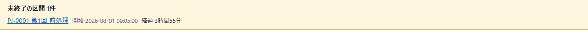
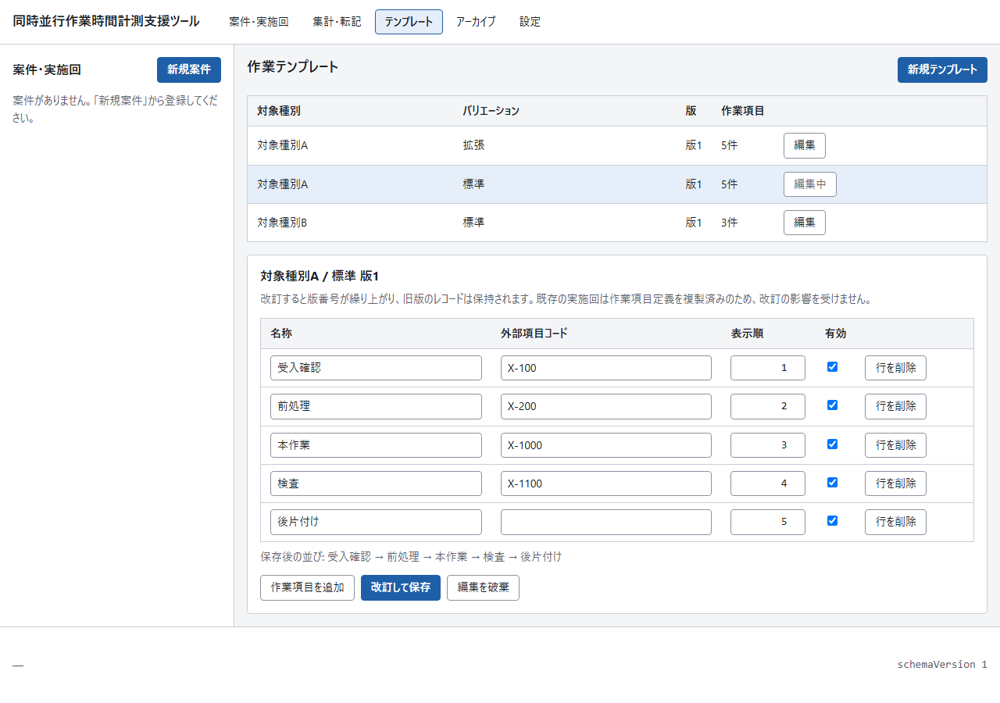
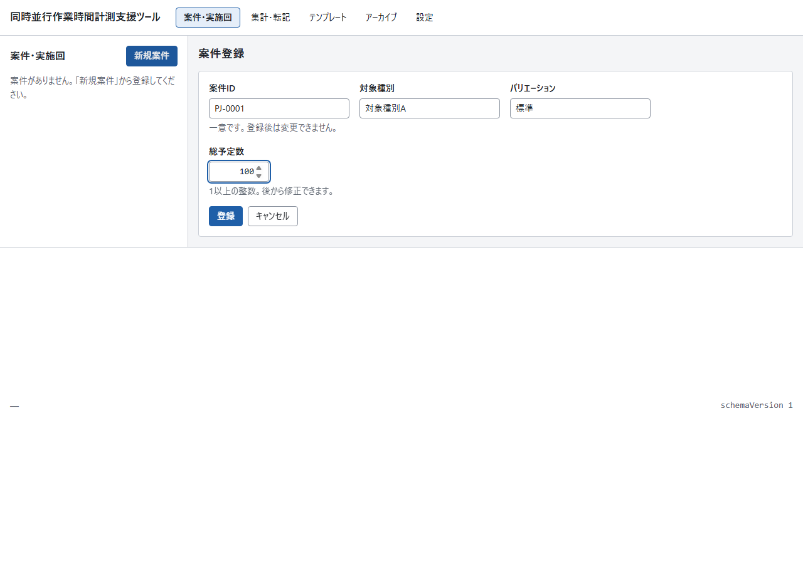
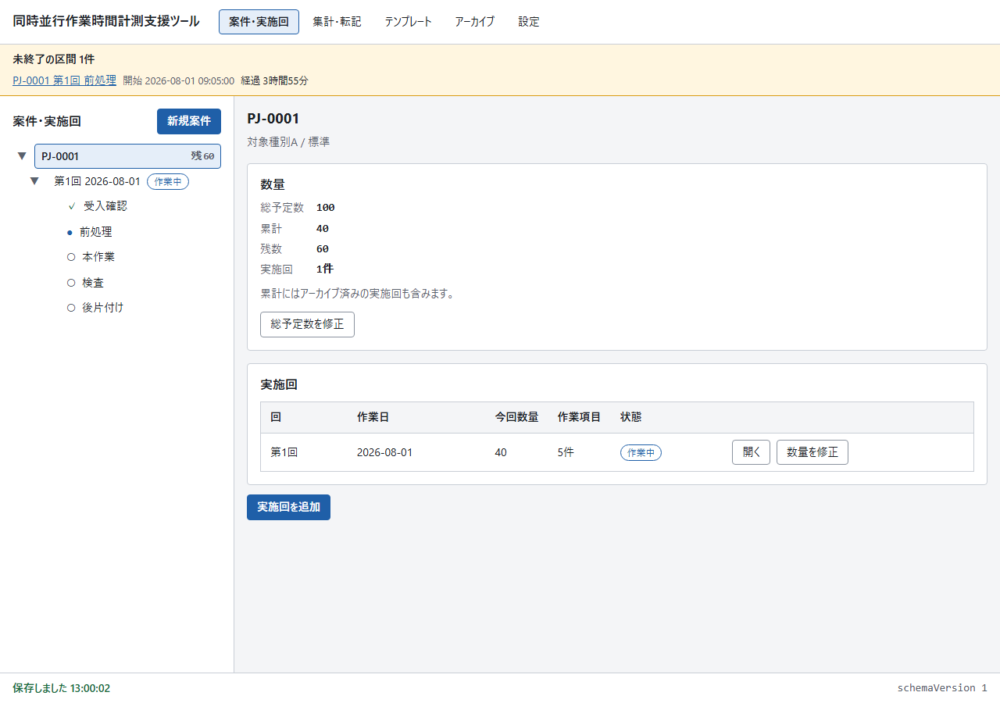
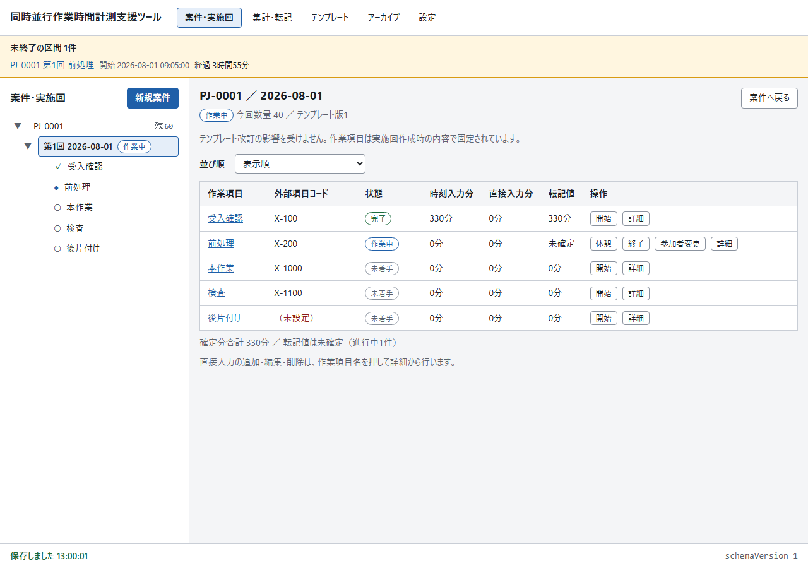
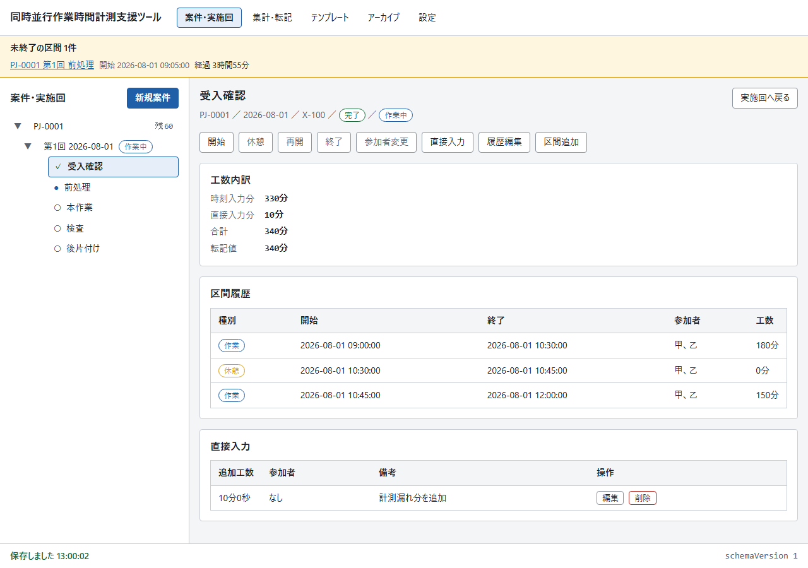
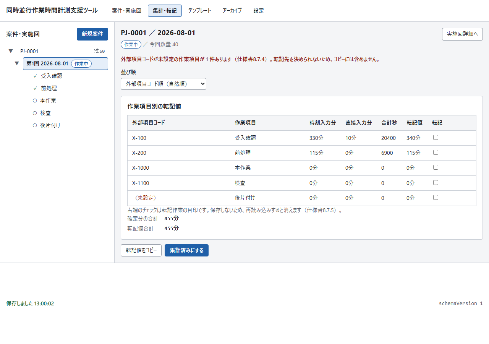
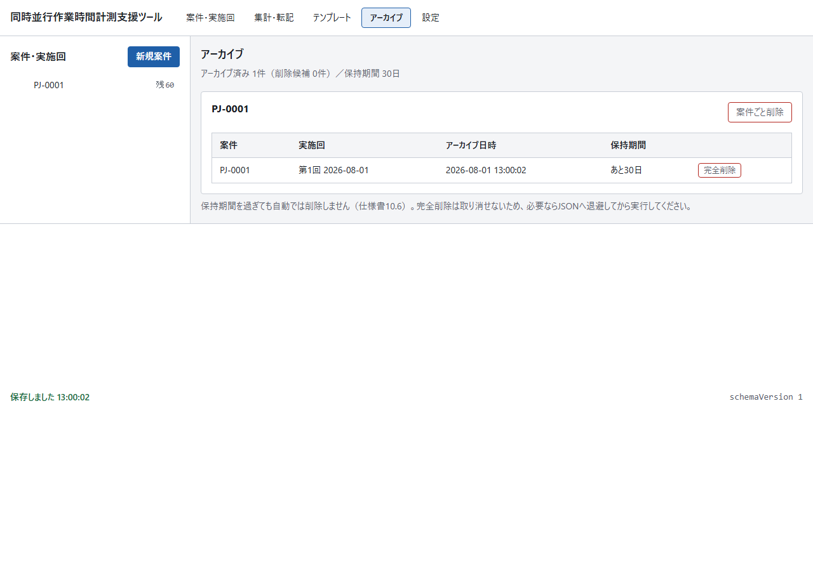
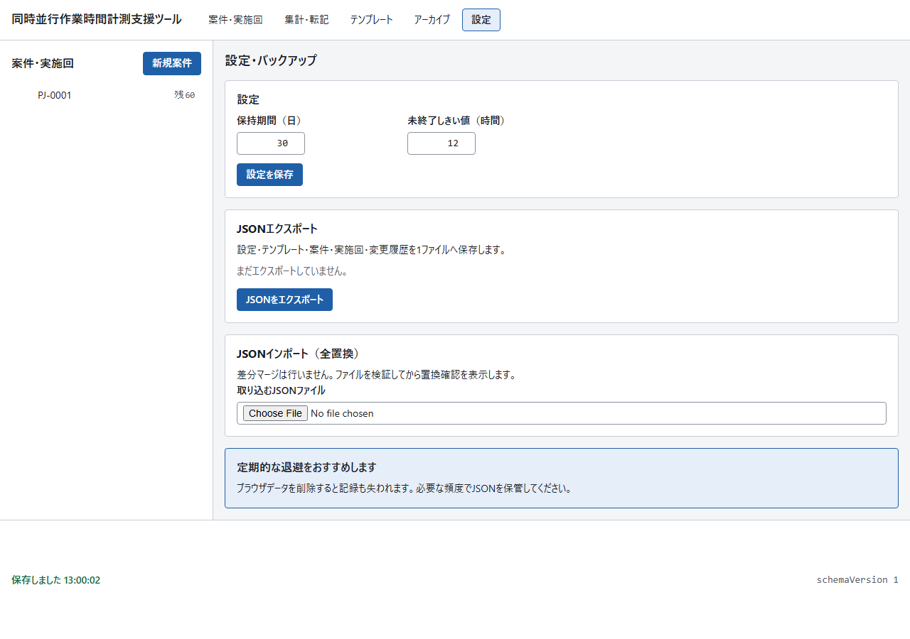
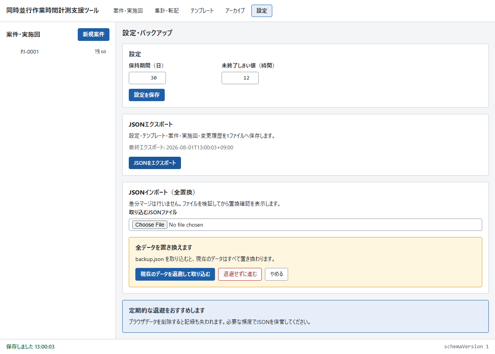

# 画面リファレンス

対象バージョン: v0.1.0 ｜ [説明書の目次へ](README.md)

画面はヘッダーで切り替える5つと、左ツリーの選択で切り替わる詳細（案件・実施回・作業項目）で構成されます。

画面写真は1280px幅・架空データで撮影した例です。ブラウザーや表示幅によって、ファイル選択欄などOS標準部品の見た目やボタンの折り返し位置は異なります。

| ヘッダーの表示 | 内容 |
| -------------- | ---- |
| 案件・実施回 | 左ツリーで選んだ対象の詳細（案件詳細／実施回詳細／作業項目詳細） |
| 集計・転記 | 選択中の実施回の転記値一覧と状態変更 |
| テンプレート | 作業テンプレートの登録・改訂 |
| アーカイブ | アーカイブ済み実施回の一覧と完全削除 |
| 設定 | 保持期間・しきい値の設定と、JSONエクスポート／インポート |

## 共通の部品

### 左ツリー（案件・実施回）

案件 → 実施回 → 作業項目 の3階層。行を選ぶと右側の詳細が切り替わります。

- 案件行: 案件IDと残数バッジ（「残60」など。総予定数を超えると警告色）
- 実施回行: 「第1回 2026-08-01」と状態バッジ（作業中／集計済み／転記済み）
- 作業項目行: 状態記号（○未着手 ●作業中 ◐休憩中 ✓完了）と名前
- 「新規案件」ボタンから案件登録画面へ
- アーカイブ済みの実施回はツリーに出ません（累計には含まれます）
- キーボードでは `↑` `↓` で行を移動し、`→` で展開、`←` で折りたたみ、`Enter` または `Space` で選択できます

### 警告領域（画面上部）

内容があるときだけ現れます。出るのは3種類です。

| 表示 | 意味 |
| ---- | ---- |
| 未終了の区間 N件 | 終了していない作業・休憩区間の一覧。行を押すとその作業項目詳細へ移動。開始からしきい値（既定12時間）を超えると「しきい値超過」と強調 |
| 同じデータを別のタブでも開いています | 多重タブの警告。同時に操作すると後から保存した内容で上書きされます |
| 画面の処理でエラーが発生しました | 想定外のエラー。続く場合は設定画面からJSONへ退避してください |

### 保存状態表示（画面下部）

- 左側: 保存の状態（「保存しました HH:MM:SS」「保存中…」「保存に失敗しました…」）。操作のたびに自動保存されます。
- 右側: `schemaVersion`。エクスポート／インポートの版の照合に使います。

## 作業テンプレート画面

| 要素 | 説明 |
| ---- | ---- |
| テンプレート一覧 | 対象種別／バリエーション／版／作業項目数。行を選ぶと下に編集欄が開く |
| 「新規テンプレート」 | 対象種別とバリエーションを入力して登録。同じ組み合わせは二重登録できない（既存を改訂する） |
| 作業項目の編集表 | 名称／外部項目コード／表示順／有効。「行を削除」「作業項目を追加」 |
| 「保存後の並び」 | 表示順を振り直した結果のプレビュー |
| 「改訂して保存」 | 版を上げて保存。**作成済みの実施回には影響しない** |
| 「編集を破棄」 | 保存済みの内容へ戻す |

- 無効にした作業項目は、以後の実施回作成で候補に出ません（旧実施回には残ります）。
- 旧版の閲覧画面はありません。

## 案件登録画面

| 要素 | 説明 |
| ---- | ---- |
| 案件ID | 一意。前後の空白は除いて登録される |
| 対象種別／バリエーション | この組でテンプレートが決まる。有効なテンプレートが無い組は登録時に案内が出る |
| 総予定数 | 1以上の整数 |
| 登録済み案件の案内 | 既存の案件IDを入れると内容が表示され、「この案件へ実施回を追加」で続きへ |

## 案件詳細

| 要素 | 説明 |
| ---- | ---- |
| 数量カード | 総予定数／累計／残数／実施回数。累計にはアーカイブ済みも含む。「総予定数を修正」で変更 |
| 実施回一覧 | 回／作業日／今回数量／作業項目数／状態。「開く」で実施回詳細へ、「数量を修正」で今回数量を変更 |
| 「実施回を追加」 | 作業日・今回数量・生成する作業項目の選択。累計が総予定数を超えるときは確認つきで続行できる |

## 実施回詳細

| 要素 | 説明 |
| ---- | ---- |
| 見出し | 案件ID／作業日／状態／今回数量／生成元テンプレート版 |
| 並び順 | 表示順 ⇄ 外部項目コード順（自然順） |
| 作業項目の表 | 作業項目／外部項目コード／状態／時刻入力分／直接入力分／転記値。未終了区間があると転記値は「未確定」 |
| 行の操作ボタン | 状態に応じて 開始・休憩・再開・終了・参加者変更 が出る。押すと日時と参加者の入力フォームが開く |
| 作業項目名のリンク | 作業項目詳細へ |
| 「詳細」 | 転記値の内訳を表示 |

状態と操作の対応:

| 作業項目の状態 | できる操作 |
| -------------- | ---------- |
| 未着手 | 開始、直接入力、区間追加 |
| 作業中 | 休憩、終了、参加者変更、直接入力、履歴編集、区間追加 |
| 休憩中 | 再開、終了、参加者変更、直接入力、履歴編集、区間追加 |
| 完了 | 開始、直接入力、履歴編集、区間追加 |
| （実施回が転記済み・アーカイブ） | 閲覧のみ |

集計済みの実施回で「開始」など未終了区間を作る操作をすると、「集計済みを解除して作業を再開しますか」の確認が出ます。

## 作業項目詳細

| 要素 | 説明 |
| ---- | ---- |
| 見出し | 作業項目名／案件ID・作業日／外部項目コード／状態 |
| 操作ボタン | 開始・休憩・再開・終了・参加者変更・直接入力・履歴編集・区間追加（状態に応じて活性化） |
| 工数内訳カード | 時刻入力分／直接入力分／合計／転記値 |
| 区間履歴カード | 種別（作業／休憩）／開始／終了（未終了は「進行中」）／参加者／工数。「履歴編集」中は行ごとに「編集」「削除」 |
| 直接入力カード | 追加工数／参加者／備考。行ごとに編集・削除 |

区間・直接入力の削除は理由の入力が必須で、変更履歴に残ります。

## 集計・転記画面

| 要素 | 説明 |
| ---- | ---- |
| 転記値の表 | 外部項目コード／作業項目／時刻入力分／直接入力分／合計秒／転記値／転記チェック |
| 転記チェック | 消し込みの目印。保存されず、再読み込みで消える |
| 合計 | 確定分の合計／転記値合計 |
| 「転記値をコピー」 | タブ区切りテキストをコピー。並びは常に外部項目コード順。コード未設定の項目は含まれない |
| 状態変更ボタン | 実施回の状態に応じて表示: 「集計済みにする」「作業中へ戻す」「実施回を転記済みにする」「転記済みを取り消す」（理由必須）「アーカイブへ移す」 |

未終了区間がある間は「集計済みにする」は押せず、理由がツールチップに出ます。

## アーカイブ画面

| 要素 | 説明 |
| ---- | ---- |
| 概況 | アーカイブ済み件数／削除候補件数／保持期間 |
| 案件ごとのカード | 実施回の一覧（案件／実施回／アーカイブ日時／保持期間）。「あと N日」または「削除候補」 |
| 「完全削除」 | 削除候補になった実施回のみ押せる。理由入力 → 退避の確認（退避してから削除を推奨） |
| 「案件ごと削除」 | 配下の実施回がすべて削除候補（または0件）の案件を丸ごと削除 |

保持期間を過ぎても自動では削除されません。

## 設定・バックアップ画面

| 要素 | 説明 |
| ---- | ---- |
| 設定カード | 保持期間（日）／未終了しきい値（時間）。「設定を保存」 |
| JSONエクスポート | 全データを1ファイルへダウンロード。最終エクスポート日時を表示 |
| JSONインポート（全置換） | ファイルを選ぶと検証 → 置換確認。「現在のデータを退避して取り込む」を推奨 |

---

前: [操作ガイド](02-guide.md) ｜ 次: [トラブルとFAQ](04-faq.md)
